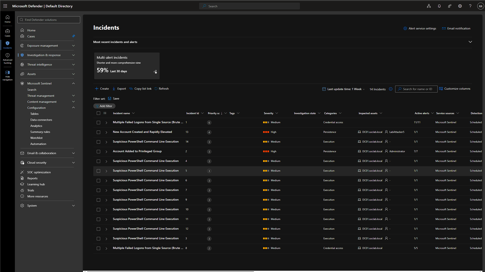
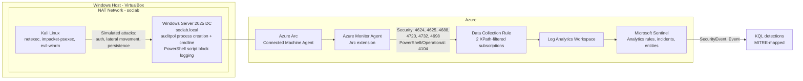
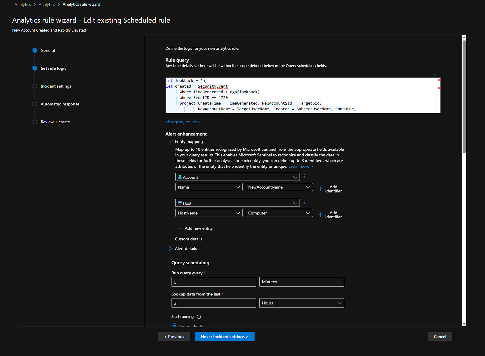
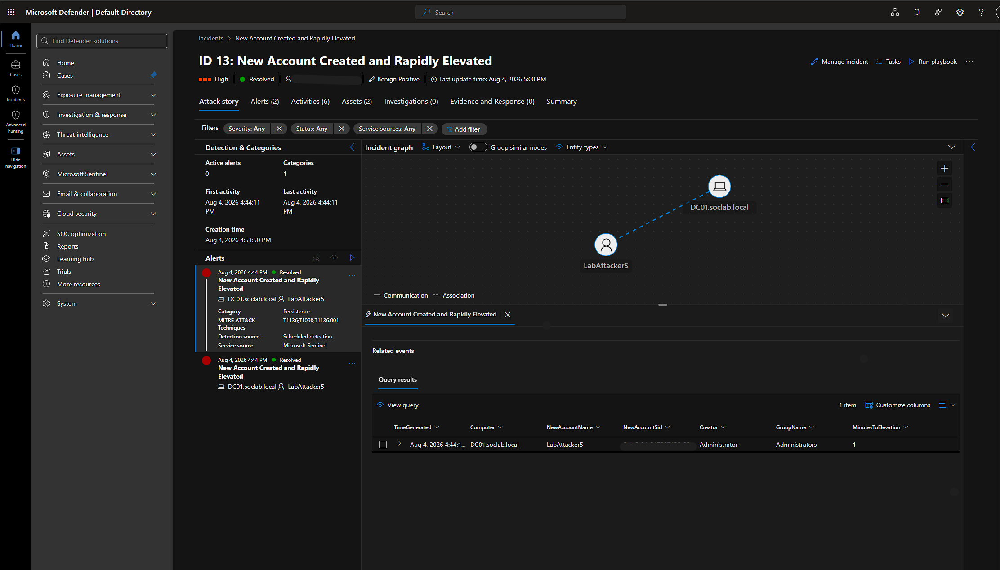
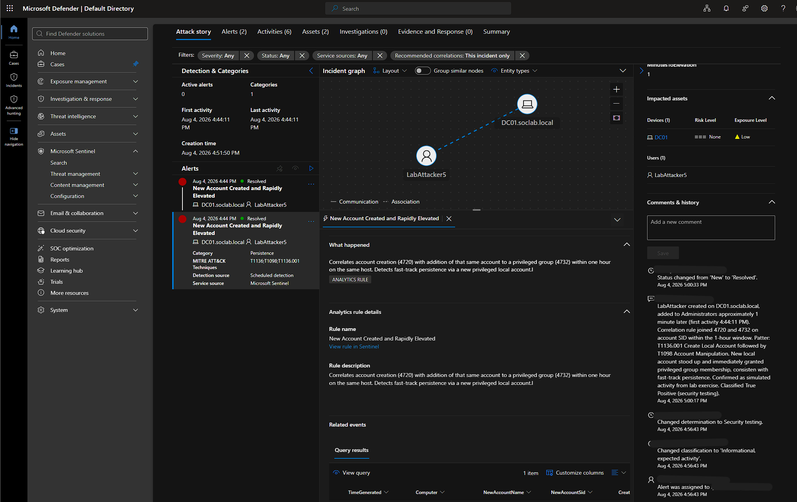

# Azure Sentinel SOC Home Lab

A hybrid, on-premises-to-cloud SOC lab for practicing detection engineering and incident
response with Microsoft Sentinel. A locally virtualized Windows Server 2025 domain
controller is connected to Azure through Azure Arc, security events flow into a Log
Analytics workspace, and four custom scheduled analytics rules generate and correlate
incidents in Microsoft Sentinel.

The lab covers the full path: hybrid onboarding, log source configuration, custom
detections mapped to MITRE ATT&CK, attack simulation, and incident lifecycle. Phase 2
adds an AI-augmented triage layer on top of the working SIEM.


<!-- SCREENSHOT: the Incidents queue showing incidents across all four rule types
     (Brute Force, Privileged Group, Suspicious PowerShell, New Account Elevated).
     Redact tenant/subscription/workspace IDs and the assignee email. -->

---

## Why Hybrid, Not a Native Azure VM

Most beginner Sentinel labs spin up a Windows VM directly inside Azure. This lab instead
runs the domain controller locally in VirtualBox and connects it to Azure through Azure
Arc, which is closer to how many real organizations onboard on-premises or non-Azure
infrastructure into a cloud SIEM. It also exercises the Arc registration, authentication,
and agent troubleshooting layer that a pure Azure-VM lab skips entirely. Several of the
hardest problems in this lab, documented in the
[troubleshooting journal](docs/troubleshooting-journal.md), came directly from that Arc
layer and would never appear in a native Azure VM setup.

---

## Architecture


### Components

| Component | Role |
|---|---|
| Windows Server 2025 (VirtualBox) | Domain controller for `soclab.local`, primary log source |
| Kali Linux (VirtualBox) | Attacker/simulation host |
| VirtualBox NAT Network | Shared network allowing both VMs to communicate and reach the internet independently |
| Azure Arc | Registers the on-premises DC as a manageable Azure resource |
| Azure Monitor Agent (AMA) | Installed via Arc extension; reads Windows Event Logs and forwards them |
| Data Collection Rule (DCR) | Defines exactly which events AMA collects and forwards |
| Log Analytics Workspace | Central store for all collected log data |
| Microsoft Sentinel | SIEM layer for querying, detection rules, and incident management |

Microsoft Sentinel now runs in the Microsoft Defender portal. The Azure portal Sentinel
experience is being retired, and this lab was migrated to and operated from the unified
Defender portal. Ingestion (Arc, AMA, DCR, Log Analytics) is unchanged by that move.

---

## Data Sources Collected

Two Windows Event Log subscriptions are configured on the DCR, each targeting a specific
log with a custom XPath filter rather than collecting entire log categories wholesale.

**Security log:**
```
Security!*[System[(EventID=4624 or EventID=4625 or EventID=4688 or EventID=4720 or EventID=4732 or EventID=4698)]]
```

**PowerShell Operational log:**
```
Microsoft-Windows-PowerShell/Operational!*[System[(EventID=4104)]]
```

### Event ID Reference

| Event ID | Log | Meaning |
|---|---|---|
| 4624 | Security | Successful logon |
| 4625 | Security | Failed logon attempt |
| 4688 | Security | Process creation (with command-line auditing enabled) |
| 4720 | Security | User account created |
| 4732 | Security | Member added to a security-enabled local group |
| 4698 | Security | Scheduled task created |
| 4104 | PowerShell Operational | Script block logging (captures deobfuscated PowerShell content) |

These event types cover the core arc of a typical intrusion: initial access attempts
(4624/4625), attacker execution once inside (4688, 4104), and common persistence or
privilege escalation actions (4698, 4720, 4732). Collecting only these IDs keeps ingestion
lean and avoids the noise and cost of collecting the entire Security log.

One schema detail worth noting: the DCR routes both event log subscriptions into the
`SecurityEvent` table, so 4104 PowerShell Operational events land there rather than in the
`Event` table. That is not the default routing, and it affects how the PowerShell detection
is written. See troubleshooting entry 9.

---

## Prerequisites Configured on the Domain Controller

A fresh Windows Server install does not audit everything needed for the above event IDs to
fire. The following were configured explicitly:

```powershell
# Required for 4688 to generate
auditpol /set /subcategory:"Process Creation" /success:enable

# Required for 4698
auditpol /set /subcategory:"Other Object Access Events" /success:enable /failure:enable
```

**Local Group Policy:**
- `Computer Configuration > Administrative Templates > System > Audit Process Creation > Include command line in process creation events` — **Enabled** (without this, 4688 fires but the CommandLine field is blank)
- `Computer Configuration > Administrative Templates > Windows Components > Windows PowerShell > Turn on PowerShell Script Block Logging` — **Enabled** (source of event 4104)

Logon/logoff and account management auditing were already enabled by default on a fresh
domain controller promotion.

---

## Detections

Four production-shaped scheduled analytics rules run against the `SecurityEvent` table.
Each has a threshold, mapped entities, a MITRE technique, and a documented false-positive
profile. Full writeup in [docs/detections.md](docs/detections.md); the raw queries are in
[detections/](detections).

| Rule | Technique | Tactic | Severity |
|---|---|---|---|
| Multiple Failed Logons from Single Source | T1110 Brute Force | Credential Access | Medium |
| Account Added to Privileged Group | T1098 Account Manipulation | Persistence, Priv Esc | High |
| Suspicious PowerShell Command Line Execution | T1059.001, T1027 | Execution, Defense Evasion | Medium |
| New Account Created and Rapidly Elevated | T1136.001, T1098 | Persistence, Priv Esc | High |


<!-- SCREENSHOT: the Alert enhancement > Entity mapping panel on one rule, showing
     IP/Host/Account/Process mapped to query columns. -->

### Featured: multi-stage correlation

The strongest detection in the lab is **New Account Created and Rapidly Elevated**. Instead
of alerting on a single event, it joins two distinct event IDs, account creation (4720) and
privileged group addition (4732), and fires only when the same account is created and then
elevated within one hour on the same host.

The join key is the account **SID** (`TargetSid` on 4720, `MemberSid` on 4732), not the
username. That choice is the point of the rule: 4732 does not carry the member name
reliably, so joining on name would miss the correlation. The output includes
`MinutesToElevation`, quantifying how fast the elevation happened. In the sample below the
account went from created to Administrators in about one minute.


<!-- SCREENSHOT: incident ID 13 (New Account Created and Rapidly Elevated), Resolved /
     True positive, showing the incident graph with the account and host nodes connected. -->

Query: [detections/04-new-account-rapidly-elevated.kql](detections/04-new-account-rapidly-elevated.kql)

---

## Attack Simulation

The Kali Linux VM sits on the same VirtualBox NAT Network as the domain controller, giving
it direct network access while keeping independent internet connectivity.

Tools:

- **netexec (nxc)** — SMB credential brute force to generate 4625 failed logon events
- **impacket-psexec** — remote execution over SMB to generate 4688 process creation events (blocked by Defender, but the attempt is logged)
- **evil-winrm** — WinRM remote PowerShell shell for interactive command execution
- **Local PowerShell / cmd (fallback)** — direct execution on the DC to generate specific event IDs when remote execution is blocked

### Simulated event generation

Network attack, run from Kali:
```bash
# 4625 - failed logons (brute force). Spraying a nonexistent user still logs 4625
# and avoids locking out the real Administrator.
nxc smb <DC_IP> -u nonexistentuser -p 'x1' 'x2' 'x3' 'x4' 'x5' 'x6'
```

Local actions, run on the DC:
```powershell
# 4720 then 4732 - new account, then elevation (triggers the correlation rule)
net user LabAttacker P@ssw0rd123! /add
net localgroup Administrators LabAttacker /add

# 4688 - suspicious command line. Decodes to Get-Process; harmless, exercises
# multiple match terms. The hidden window is expected to flash and close.
powershell.exe -nop -w hidden -EncodedCommand RwBlAHQALQBQAHIAbwBjAGUAcwBzAA==

# 4698 - scheduled task persistence
schtasks /create /tn "LabTest" /tr "calc.exe" /sc once /st 00:00 /f
```

In a real intrusion all of this would originate from the attacker host. Running the local
actions directly on the DC is the reliable way to generate those specific event IDs in a
lab without a full remote-exec foothold, which is the documented fallback pattern.

---

## Incident Lifecycle

Incidents are worked end to end in the Defender portal: assign, set active, investigate
using the mapped entities and custom details, classify, and close with a written
justification. The correlation incident below was worked by hand and closed as a true
positive, which serves as the human-authored baseline the Phase 2 AI triage output is
measured against.


<!-- SCREENSHOT: a resolved, classified incident with the investigation comment visible. -->

---

## Current Status

- Hybrid Arc onboarding complete, DC reporting to Sentinel via AMA
- Seven event IDs confirmed ingested and queryable
- Four scheduled analytics rules live, entity-mapped, MITRE-tagged
- Incidents generating across all four rule types, including multi-stage correlation
- Full incident lifecycle practiced and documented
- Phase 2 (AI triage) in progress

Sample ingestion counts from a validation run:

| Event ID | Count | Status |
|---|---|---|
| 4688 | 507 | Confirmed |
| 4624 | 246 | Confirmed |
| 4104 | 69 | Confirmed |
| 4625 | 6+ per run | Confirmed |
| 4698 | 2 | Confirmed |
| 4720 | 1+ per run | Confirmed |
| 4732 | 1+ per run | Confirmed |

---

## Phase 2: AI-Augmented Incident Triage

In progress. Pulls Sentinel incidents through the REST API, enriches each with the
surrounding Windows event telemetry, sends the bundle to an LLM for structured triage
(summary, attack narrative, MITRE mapping with cited evidence, suggested verdict,
recommended actions), and writes the result back as an incident comment.

The differentiator is measurement. Because the attacks were generated deliberately, the
correct MITRE technique for every incident is known, so the model's technique mapping can
be scored with precision and recall against ground truth rather than eyeballed. The
pipeline labels AI output as automated and unverified and never auto-closes incidents.

Design and methodology: [docs/phase2-ai-triage.md](docs/phase2-ai-triage.md)

---

## Repository Layout

```
README.md                          Overview (this file)
detections/                        Raw KQL for the four analytics rules
docs/
  detections.md                    Detection-engineering writeup per rule
  phase2-ai-triage.md              Phase 2 goal, architecture, eval methodology
  troubleshooting-journal.md       Nine documented problems, root causes, fixes
  screenshots/                     Portal captures referenced above
```

---

## Troubleshooting

Building this lab surfaced several non-obvious issues. Full writeups with root causes and
fixes are in [docs/troubleshooting-journal.md](docs/troubleshooting-journal.md).

1. AD DS role installed silently incomplete via GUI wizard
2. Azure Arc onboarding stuck on biometric prompt inside VM
3. Invalid change token error due to domain controller clock drift
4. HTTP 401 during Arc resource creation due to wrong tenant resolution
5. DCR silently rejecting its own XPath query with no portal-side error
6. Path assumptions in official documentation not matching actual Arc agent folder names
7. Analytics rule produced correct results but zero entities (entity mapping not configured)
8. Azure Monitor Agent has no `AzureMonitorAgent` service on Arc installs
9. Event 4104 script block text is not in a queryable column
