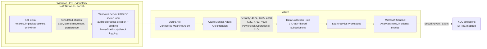

# Azure Sentinel SOC Home Lab

**A hybrid on-prem-to-cloud Microsoft Sentinel SOC lab: four MITRE-mapped detections
generating real incidents, plus an LLM triage pipeline whose technique mapping is scored
against ground truth — not eyeballed.**

A locally virtualized Windows Server 2025 domain controller is connected to Azure through
Azure Arc, security events flow into a Log Analytics workspace, and four custom scheduled
analytics rules generate and correlate incidents in Microsoft Sentinel. On top of that
working SIEM, Phase 2 adds an AI-augmented triage pipeline that reads each incident's
telemetry, produces a structured, evidence-cited assessment, and is evaluated against
ground truth rather than trusted at face value.

The lab covers the full path: hybrid onboarding, log source configuration, custom
detections mapped to MITRE ATT&CK, attack simulation, incident lifecycle, and — Phase 2 —
automated triage with a real eval.


<!-- SCREENSHOT: the Incidents queue showing incidents across all four rule types
     (Brute Force, Privileged Group, Suspicious PowerShell, New Account Elevated).
     Redact tenant/subscription/workspace IDs and the assignee email. -->

---

## Why Hybrid, Not a Native Azure VM

Most beginner Sentinel labs spin up a Windows VM directly inside Azure. This lab instead
runs the domain controller locally in VirtualBox and connects it to Azure through Azure
Arc, which is closer to how many real organizations onboard on-premises or non-Azure
infrastructure into a cloud SIEM. It also exercises the Arc registration, authentication,
and agent troubleshooting layer that a pure Azure-VM lab skips entirely. Several of the
hardest problems in this lab, documented in the
[troubleshooting journal](docs/troubleshooting-journal.md), came directly from that Arc
layer and would never appear in a native Azure VM setup.

---

## Architecture


### Components

| Component | Role |
|---|---|
| Windows Server 2025 (VirtualBox) | Domain controller for `soclab.local`, primary log source |
| Kali Linux (VirtualBox) | Attacker/simulation host |
| VirtualBox NAT Network | Shared network allowing both VMs to communicate and reach the internet independently |
| Azure Arc | Registers the on-premises DC as a manageable Azure resource |
| Azure Monitor Agent (AMA) | Installed via Arc extension; reads Windows Event Logs and forwards them |
| Data Collection Rule (DCR) | Defines exactly which events AMA collects and forwards |
| Log Analytics Workspace | Central store for all collected log data |
| Microsoft Sentinel | SIEM layer for querying, detection rules, and incident management |

Microsoft Sentinel now runs in the Microsoft Defender portal. The Azure portal Sentinel
experience is being retired, and this lab was migrated to and operated from the unified
Defender portal. Ingestion (Arc, AMA, DCR, Log Analytics) is unchanged by that move.

---

## Data Sources Collected

Two Windows Event Log subscriptions are configured on the DCR, each targeting a specific
log with a custom XPath filter rather than collecting entire log categories wholesale.

**Security log:**
```
Security!*[System[(EventID=4624 or EventID=4625 or EventID=4688 or EventID=4720 or EventID=4732 or EventID=4698)]]
```

**PowerShell Operational log:**
```
Microsoft-Windows-PowerShell/Operational!*[System[(EventID=4104)]]
```

### Event ID Reference

| Event ID | Log | Meaning |
|---|---|---|
| 4624 | Security | Successful logon |
| 4625 | Security | Failed logon attempt |
| 4688 | Security | Process creation (with command-line auditing enabled) |
| 4720 | Security | User account created |
| 4732 | Security | Member added to a security-enabled local group |
| 4698 | Security | Scheduled task created |
| 4104 | PowerShell Operational | Script block logging (captures deobfuscated PowerShell content) |

These event types cover the core arc of a typical intrusion: initial access attempts
(4624/4625), attacker execution once inside (4688, 4104), and common persistence or
privilege escalation actions (4698, 4720, 4732). Collecting only these IDs keeps ingestion
lean and avoids the noise and cost of collecting the entire Security log.

One schema detail worth noting: the DCR routes both event log subscriptions into the
`SecurityEvent` table, so 4104 PowerShell Operational events land there rather than in the
`Event` table. That is not the default routing, and it affects how the PowerShell detection
is written. See troubleshooting entry 9.

---

## Prerequisites Configured on the Domain Controller

A fresh Windows Server install does not audit everything needed for the above event IDs to
fire. The following were configured explicitly:

```powershell
# Required for 4688 to generate
auditpol /set /subcategory:"Process Creation" /success:enable

# Required for 4698
auditpol /set /subcategory:"Other Object Access Events" /success:enable /failure:enable
```

**Local Group Policy:**
- `Computer Configuration > Administrative Templates > System > Audit Process Creation > Include command line in process creation events` — **Enabled** (without this, 4688 fires but the CommandLine field is blank)
- `Computer Configuration > Administrative Templates > Windows Components > Windows PowerShell > Turn on PowerShell Script Block Logging` — **Enabled** (source of event 4104)

Logon/logoff and account management auditing were already enabled by default on a fresh
domain controller promotion.

---

## Detections

Four production-shaped scheduled analytics rules run against the `SecurityEvent` table.
Each has a threshold, mapped entities, a MITRE technique, and a documented false-positive
profile. Full writeup in [docs/detections.md](docs/detections.md); the raw queries are in
[detections/](detections).

| Rule | Technique | Tactic | Severity |
|---|---|---|---|
| Multiple Failed Logons from Single Source | T1110 Brute Force | Credential Access | Medium |
| Account Added to Privileged Group | T1098 Account Manipulation | Persistence, Priv Esc | High |
| Suspicious PowerShell Command Line Execution | T1059.001, T1027 | Execution, Defense Evasion | Medium |
| New Account Created and Rapidly Elevated | T1136.001, T1098 | Persistence, Priv Esc | High |


<!-- SCREENSHOT: the Alert enhancement > Entity mapping panel on one rule, showing
     IP/Host/Account/Process mapped to query columns. -->

### Featured: multi-stage correlation

The strongest detection in the lab is **New Account Created and Rapidly Elevated**. Instead
of alerting on a single event, it joins two distinct event IDs, account creation (4720) and
privileged group addition (4732), and fires only when the same account is created and then
elevated within one hour on the same host.

The join key is the account **SID** (`TargetSid` on 4720, `MemberSid` on 4732), not the
username. That choice is the point of the rule: 4732 does not carry the member name
reliably, so joining on name would miss the correlation. The output includes
`MinutesToElevation`, quantifying how fast the elevation happened. In the sample below the
account went from created to Administrators in about one minute.

The same SID-vs-name distinction that makes this KQL rule correct is exactly what a bug in
the Phase 2 enrichment layer got wrong later — see [below](#the-eval-discriminates).


<!-- SCREENSHOT: incident ID 13 (New Account Created and Rapidly Elevated), Resolved /
     BenignPositive, showing the incident graph with the account and host nodes connected. -->

Query: [detections/04-new-account-rapidly-elevated.kql](detections/04-new-account-rapidly-elevated.kql)

---

## Attack Simulation

The Kali Linux VM sits on the same VirtualBox NAT Network as the domain controller, giving
it direct network access while keeping independent internet connectivity.

Tools:

- **netexec (nxc)** — SMB credential brute force to generate 4625 failed logon events
- **impacket-psexec** — remote execution over SMB to generate 4688 process creation events (blocked by Defender, but the attempt is logged)
- **evil-winrm** — WinRM remote PowerShell shell for interactive command execution
- **Local PowerShell / cmd (fallback)** — direct execution on the DC to generate specific event IDs when remote execution is blocked

### Simulated event generation

Network attack, run from Kali:
```bash
# 4625 - failed logons (brute force). Spraying a nonexistent user still logs 4625
# and avoids locking out the real Administrator.
nxc smb <DC_IP> -u nonexistentuser -p 'x1' 'x2' 'x3' 'x4' 'x5' 'x6'
```

Local actions, run on the DC:
```powershell
# 4720 then 4732 - new account, then elevation (triggers the correlation rule)
net user LabAttacker P@ssw0rd123! /add
net localgroup Administrators LabAttacker /add

# 4688 - suspicious command line. Decodes to Get-Process; harmless, exercises
# multiple match terms. The hidden window is expected to flash and close.
powershell.exe -nop -w hidden -EncodedCommand RwBlAHQALQBQAHIAbwBjAGUAcwBzAA==

# 4698 - scheduled task persistence
schtasks /create /tn "LabTest" /tr "calc.exe" /sc once /st 00:00 /f
```

In a real intrusion all of this would originate from the attacker host. Running the local
actions directly on the DC is the reliable way to generate those specific event IDs in a
lab without a full remote-exec foothold, which is the documented fallback pattern.

---

## Incident Lifecycle

Incidents are worked end to end in the Defender portal: assign, set active, investigate
using the mapped entities and custom details, classify, and close with a written
justification. The correlation incident below was worked by hand and closed as
**BenignPositive** — the correct classification for a self-simulated, authorized lab
account creation, not a genuine compromise — which serves as the human-authored baseline
the Phase 2 AI triage output is measured against.


<!-- SCREENSHOT: a resolved, classified incident with the investigation comment visible. -->

---

## Current Status

- Hybrid Arc onboarding complete, DC reporting to Sentinel via AMA
- Seven event IDs confirmed ingested and queryable
- Four scheduled analytics rules live, entity-mapped, MITRE-tagged
- Incidents generating across all four rule types, including multi-stage correlation
- Full incident lifecycle practiced and documented
- **Phase 2 (AI triage) delivered:** collect → enrich → triage → writeback → eval, scored
  against ground truth (below)

Sample ingestion counts from a validation run:

| Event ID | Count | Status |
|---|---|---|
| 4688 | 507 | Confirmed |
| 4624 | 246 | Confirmed |
| 4104 | 69 | Confirmed |
| 4625 | 6+ per run | Confirmed |
| 4698 | 2 | Confirmed |
| 4720 | 1+ per run | Confirmed |
| 4732 | 1+ per run | Confirmed |

---

## Phase 2: AI-Augmented Incident Triage

Delivered. Five stages, each independently runnable against saved JSON before ever calling
a live API or spending a token:

| Stage | File | What it does |
|---|---|---|
| Collect | `src/collect.py` | Pulls an incident, its alerts, and its mapped entities from Sentinel via the REST API |
| Enrich | `src/enrich.py` | For each entity, queries the surrounding `SecurityEvent` telemetry around the incident's activity time |
| Triage | `src/triage.py` | Sends the enriched bundle to Claude Sonnet 5, which returns structured JSON: summary, chronological attack narrative, MITRE technique mapping with cited evidence, suggested verdict, recommended actions, and open verification gaps |
| Writeback | `src/writeback.py` | Renders the triage output as the markdown comment it would post to the incident, prefixed as automated/unverified AI triage; live posting is code-complete but gated behind an explicit `--live` flag |
| Eval | `evals/score.py` | Scores the model's MITRE technique output against each rule's *intended* tags — an objective label set when the detection was built, not a judgment call about what happened to be "present" in a given run |

Design and methodology: [docs/phase2-ai-triage.md](docs/phase2-ai-triage.md). System prompt:
[prompts/triage_system.md](prompts/triage_system.md).

### The eval discriminates

The headline result of this project is not an accuracy number — it's that the eval is
rigorous enough to fail the model when its evidence doesn't hold up, and that rigor caught
a real bug in the pipeline itself.

Every technique the model cites is independently checked against the incident's actual
telemetry (`EventRecordId` or `EventID`+timestamp verified to exist in the enriched
bundle) before it counts as a real finding. A technique ID that happens to match the
correct answer isn't enough — if the cited evidence doesn't check out, it's scored as
**ungrounded**, not credited.

That distinction caught something real. The first live triage run on incident 13 (a
correlation between account creation and privileged-group elevation) came back like this:

| | Before the fix | After the fix |
|---|---|---|
| `T1098` confidence | `low` | `high` |
| `T1098` evidence | *"…no 4732 EventID for LabAttacker5 is present in the supplied SecurityEvent telemetry…"* | *"EventID 4732 at 2026-08-04T21:44:11Z, MemberSid=…-1106 (LabAttacker5) added to Builtin\Administrators… (EventRecordId 67871)"* |
| Eval verdict | ungrounded — scored as a miss | grounded — scored as a true positive |

The model wasn't wrong to hedge — the elevation event genuinely wasn't in the telemetry it
was given. Root-caused to two bugs in `enrich.py`: privileged-group events reference the
added account only by SID (`MemberSid`), never by name, so an entity query matched only on
account name could never find the escalation event for the account being escalated — the
same SID-vs-name distinction the KQL detection itself gets right (see
[above](#featured-multi-stage-correlation)). Separately, a 100-row telemetry cap ordered
oldest-first was silently exhausted by background noise before the query reached the
incident's actual activity window, in 24 of 26 already-collected incidents. Both fixed, and
all 26 incidents re-enriched live against the (ingestion-suspended but still queryable) Log
Analytics workspace before its 30-day retention window closed. Full writeup, including how
the eval caught it: [troubleshooting journal, entry 10](docs/troubleshooting-journal.md#10-llm-triage-correctly-flagged-missing-evidence-which-surfaced-two-enrichment-bugs).

### Results

Scored 7 of the 26 collected incidents — one from each of the four detection types, plus
both correlation incidents, deliberately skipping the nine near-duplicate PowerShell
incidents that would add cost without adding eval signal. This is a small, hand-picked
sample, not a claim of broad coverage.

Under strict, automated-only evidence verification: **100% precision, 92% recall** (11 of
12 rule-intended technique labels found with independently verifiable evidence). The one
miss is a real, correct finding — cited too thinly (an `EventID` with no timestamp or
record ID) for the automated checker to verify on its own — confirmed correct by manual
review and reported as a miss rather than quietly resolved. Full breakdown, scoring rules,
and the deliberate choice to report the stricter number: [evals/results.md](evals/results.md).

### Example: incident 13, post-fix

```
T1098 (Account Manipulation) — confidence: high
Evidence: EventID 4732 at 2026-08-04T21:44:11Z, MemberSid=S-1-...-1106 (LabAttacker5)
added to Builtin\Administrators, SubjectUserName=SOCLAB\Administrator
(EventRecordId 67871); PowerShell ScriptBlock 4104 at 21:44:11.37Z:
'net localgroup Administrators LabAttacker5 /add' (EventRecordId 1199)

Suggested verdict: BenignPositive
Needs human verification: No explicit ticket, change-request, or exercise-authorization
artifact is present in the telemetry confirming this was sanctioned activity — the
BenignPositive assessment currently relies on inference from account/host/tenant naming
conventions ('LabAttacker5', 'soclab.local', 'rg-soc-lab')
```

The pipeline never auto-closes an incident or claims certainty it doesn't have — every
rendered comment (`output/incident-N-comment.md`) opens with a bold "Automated AI Triage —
Unverified" banner, and the system prompt requires the model to name what it can't confirm
rather than paper over the gap.

---

## Repository Layout

```
README.md                          Overview (this file)
detections/                        Raw KQL for the four analytics rules
prompts/
  triage_system.md                 System prompt for the Phase 2 triage model
src/
  auth.py                          Client-credentials OAuth2 for management.azure.com and api.loganalytics.io
  collect.py                       Pull incident + alerts + entities from Sentinel
  enrich.py                        Attach surrounding SecurityEvent telemetry per entity
  triage.py                        Structured LLM triage call (Claude Sonnet 5)
  writeback.py                     Render triage output as a Sentinel incident comment
evals/
  ground_truth.json                Each detection rule's intended MITRE technique tags
  score.py                         Reusable technique precision/recall scorer
  results.md                       Latest eval run: scores, discrimination proof, design notes
  fixtures/                        Preserved pre-fix triage output, used to prove the eval discriminates
docs/
  detections.md                    Detection-engineering writeup per rule
  phase2-ai-triage.md              Phase 2 goal, architecture, eval methodology
  troubleshooting-journal.md       Ten documented problems, root causes, fixes
  screenshots/                     Portal captures referenced above
```

`samples/` (collected/enriched incident bundles and triage output) and `output/` (rendered
incident comments) are gitignored working data, not checked in.

---

## Troubleshooting

Building this lab surfaced several non-obvious issues. Full writeups with root causes and
fixes are in [docs/troubleshooting-journal.md](docs/troubleshooting-journal.md).

1. AD DS role installed silently incomplete via GUI wizard
2. Azure Arc onboarding stuck on biometric prompt inside VM
3. Invalid change token error due to domain controller clock drift
4. HTTP 401 during Arc resource creation due to wrong tenant resolution
5. DCR silently rejecting its own XPath query with no portal-side error
6. Path assumptions in official documentation not matching actual Arc agent folder names
7. Analytics rule produced correct results but zero entities (entity mapping not configured)
8. Azure Monitor Agent has no `AzureMonitorAgent` service on Arc installs
9. Event 4104 script block text is not in a queryable column
10. LLM triage correctly flagged missing evidence, which surfaced two enrichment bugs
